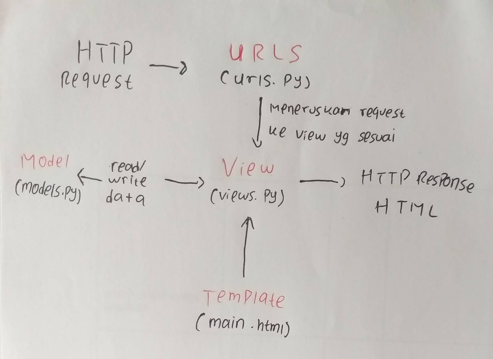

Jelaskan bagaimana cara kamu mengimplementasikan checklist di atas secara step-by-step 
    1. Membuat virtual envinronment di direktori yang kita inginkan dan kemudian mengaktifkannya.
    2. Membuat file "requirements.txt" untuk mengatur library dan dependencies yang akan digunakan di virtual env kita lalu  memasang dependencies tersebut
    3. Membuat projek django bernama items_inventory lalu mengubah "ALLOWED_HOST" agar menerima semua host
    4. Membuat aplikasi baru bernama main lalu mendaftarkannya ke "INSTALLED_APPS"
    5. Membuat folder "templates" yang berisi file HTML pada direktori apps
    6. Membuat file "models.py" pada aplikasi main dan mengisinya sesuai ketentuan tugas kemudian melakukan migrasi terhadap model tersebut
    7. Mengimpor fungsi render dan membuat fungsi "show_main" pada views.py untuk mengintegrasikan template dan view
    8. Mengisi file "main.html" sesuai views yang sudah dibuat
    9. Membuat file "urls.py" pada direktori aplikasi dan memodifikasinya
    10 Membuat file "urls.py" pada direkotori proyek dan memodifikasinya
    11. Melakukan unit testing
    12. Membuat file .gitignore sesuai tutorial lalu push ke repositori github

Buatlah bagan yang berisi request client ke web aplikasi berbasis Django beserta responnya dan jelaskan pada bagan tersebut kaitan antara urls.py, views.py, models.py, dan berkas html

    Kaitan pada gambar tersebut adalah:  
    1. urls.py akan meneruskan permintaan HTTP request ke view yang sesuai dengan request
    2. views akan merespon permintaan tersebut dengan menampilkan html yang sesuai, html tersebut akan mendapatkan data dari views.py yang diambil dari models.py. Pada bagian views kita juga bisa menerima input pengguna

Jelaskan mengapa kita menggunakan virtual environment? Apakah kita tetap dapat membuat aplikasi web berbasis Django tanpa menggunakan virtual environment?
    Kita membutuhkan virtual envinronment karena akan membantu kita dalam mengembangkan django project kita, beberapa kemudahan yang kita dapatkan adalah:
        - Isolation, membantu kita untuk mengatur versi django project kita tanpa mempengaruhi django project kita yang lain
        - Dependency management, karena saat kita membuat virtual envinronment kita dapat menginstall django dan python package dengan versi yang berbeda-beda. Oleh     karena itu, virtual env dapat membantu kita dalam mengatur hal tersebut.
        - Konsistensi, virtual envinronment membantu project kita tetap konsisten baik saat development, testing, ataupun production
    Walaupun virtual envinronment membantu kita dalam mengelola django project kita, kita tetap dapat membuat django project tanpa membuat virtual envinronment terlebih dahulu.

Jelaskan apakah itu MVC, MVT, MVVM dan perbedaan dari ketiganya.
    - MVC (Model-View-Controller)
        Model: mengelola data dan logika aplikasi
        View: Menampilkan data dari model dan menerima input
        Controller: Perantara antara model dan view yang dapat memproses input pengguna dan mengirim perintah ke tampilan
    
    - MVT (Model-View-Template)
        Model: mengelola data dan logika aplikasi
        View: Menampilkan data dari model dan menghubungkannya dengan template
        Template: Menentukan tampilan antarmuka pengguna

    - MVVM (Model, View, ViewModel)
        Model: mengelola data dan logika aplikasi
        View: Menampilkan data dari model
        ViewModel: perantara antara model dan view, dia akan mengambil data dari model dan memformatnya agar dapat ditampilkan oleh view
    
    Perbedaan tiga pola desain tersebut adalah bagaimana pola desain tersebut digunakan, MVC umumnya digunakan untuk mengembangkan aplikasi desktop, MVT digunakan oleh Django, dan MVVM digunakan untuk pengembangan aplikasi mobile

        