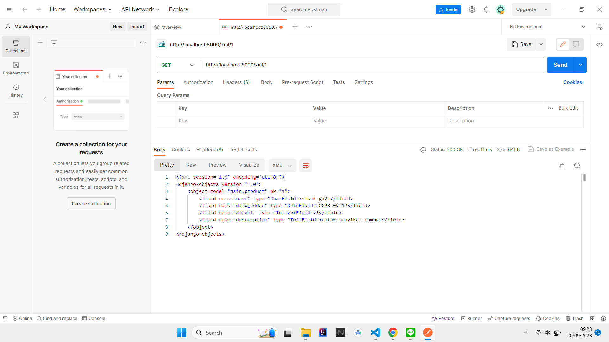

 1. **Apa perbedaan antara form POST dan form GET dalam Django?**
 
    Beberapa perbedaan anatar POST dan GET adalah sebagai berikut:

    - Pada GET, data/nilai akan akan terlihat pada URL, sedangkan pada POST tidak sehingga lebih baik gunakan POST untuk mengirim data yang sensitif.

    - Method Get membatasi data yang dikirim sampai maksimal 2047 karakter sehingga lebih baik menggunakan method POST jika ingin mengirim data yag relatif besar.

    - Method GET hanya mendukung tipe data ASCII char sedangkan method POST dapat mendukung binary data 

2. **Apa perbedaan utama antara XML, JSON, dan HTML dalam konteks pengiriman data?**

    XML(eXensible Markup Language) adalah bahasa markup yang umumnya digunakan untuk merepresentasikan data dalam struktur hierarki. Data dalam XML dijelaskan dengan tag yang dapat didefinisikan sendiri oleh pengguna. JSON(JavaScript Object Notation) adalah bahasa yang digunakan untuk merepresentasikan data dalam pasangan key-value. Beberapa perbedaan XML dan JSON adalah:

    - File XML memiliki ukuran yang lebih besar karena strukturnya yang lebih kompleks dibandingkan dengan JSON
    - XML menggunakan struktur data hierarki/tree sedangkan JSON menggunakan struktur data key-value
    - XML mendukung lebih banyak tipe data seperti tanggal dan waktu
    
    Selain XML dan JSON kita juga bisa menggunakan HTML(Hyper Text Markup Language) untuk merepresentasikan suatu data, data pada HTML harus "dibungkus" dengan predefined tag yang memiliki fungsinya masing-masing.
    
    Perbedaan utama antara XML dan JSON dengan HTML adalah XML dan JSON fokus untuk men*carry* data tanpa memikirkan tanpa memikirkan tampilan dari data tersebut, sedangkan HTML lebih fokus pada bagaimana suatu data akan ditampilkan ke pengguna.

3. **Mengapa JSON sering digunakan dalam pertukaran data antara aplikasi web modern?**

    JSON sering digunakan dalam pertukaran data pada web modern karena JSON *native* terhadap JavaScript dan hampir semua web modern menggunakan javascript hal ini membuat JSON lebih cepat diproses, selain itu ukuran file JSON relatif lebih kecil jika dibandingkan dengan format data yang lain seperti XML dan JSON memiliki struktur penulisan yang sederhana dan mudah dibaca bahkan oleh orang awam.

 4. **Jelaskan bagaimana cara kamu mengimplementasikan checklist di atas secara step-by-step**

    1. Menjalankan virtual env
    2. Mengubah routing dari `main/`menjadi `/` pada folder `items_inventory`
    3. Membuat `base.html` yang disimpan di folder `templates` pada root directory.
    4. Menambahkan directory `templates` pada `settings.py`
    5. Membuat struktur *form* yang dapat menerima data produk baru
    6. Membuat fungsi `create_product` pada `views.py` untuk menghasilkan formulir yang menambahkan produk ketika data sudah di-*submit* 
    7. Membuat file `create_product.html` sebagai tampilan *page* saat ingin menginput data baru
    8. Menambahkan *path url* ke dalam `urlpatterns` pada `urls.py` di `main` untuk fungsi `create_product` 
    9. Memodifikasi `main.html` agar dapat menampilkan item yang sudah diinput dalam bentuk tabel
    10. Membuat fungsi untuk mengambalikan data dan mengembalikand data berdasarkan id (dalam bentuk XML dan JSON)
    11. Menambahkan *path url* untuk setiap fungsi yang sudah dibuat ke `urlpatterns` pada `urls.py` di `main`.

5. **Screenshot Postman**
    
    Get product (JSON)

    

    Get product (XML)

    

    Get product by ID (JSON)

    

    Get product by ID (XML)

    

